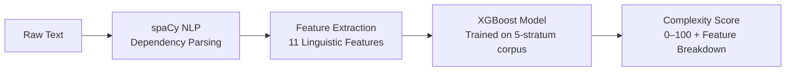

<div align="center">

#  The Philomath Index

### Linguistic Regression for Philosophical Density

*Because not all difficulty is in the syllables.*

[](https://python.org)
[](https://fastapi.tiangolo.com)
[](https://vuejs.org)
[](https://xgboost.readthedocs.io)
[](https://spacy.io)
** Live Demo:** [https://philos-index.vercel.app](https://philos-index.vercel.app)  
** API Endpoint:** [https://philos-index.onrender.com](https://philos-index.onrender.com)

---

> *"The limit of my language is the limit of my world."* — Ludwig Wittgenstein

</div>

## The Problem

Standard readability metrics — **Flesch-Kincaid**, **Gunning Fog**, **SMOG** — measure surface-level difficulty using syllable counts and sentence lengths. They are categorically blind to **conceptual compression**: the tendency of philosophical prose to encode extraordinary intellectual weight into syntactically simple structures.

A sentence by Nietzsche may contain fewer words than a line from a children's book, yet carry exponentially greater cognitive load. Standard scores would rank *Thus Spoke Zarathustra* as "easy" — a category error that exposes the inadequacy of syllable-counting as a proxy for intellectual complexity.

**The Philomath Index** fixes this. It's a regression-based scoring engine that predicts a **Complexity Score (0–100)** by modelling syntactic depth, lexical rarity, and abstractness ratios as first-class features.

##  How It Works

```
User pastes text → spaCy parses it → 11 linguistic features extracted → XGBoost predicts score → Score + breakdown returned
```



##  The 11 Engineered Features

Each text snippet is transformed into an 11-dimensional feature vector. These are the **intellectual core** of the project — every feature captures a different axis of linguistic complexity:

| # | Feature | Abbr | What It Captures |
|---|---------|------|-----------------|
| 1 | **Syntactic Depth Index** | SDI | Average token distance from sentence root in the parse tree |
| 2 | **Subclausal Density** | SCD | Subordinate clauses (relative, adverbial, complement) per sentence |
| 3 | **Abstractness Ratio** | AR | Fraction of nouns referring to intangible concepts (via WordNet + custom lexicon) |
| 4 | **Lexical Density** | LD | Ratio of content words (N/V/ADJ/ADV) to all words |
| 5 | **Vocabulary Rareness Score** | VRS | Inverted Zipf frequency, with 2× weight for philosophical domain terms |
| 6 | **MATTR** | MATTR | Moving Average Type-Token Ratio (lexical diversity, length-robust) |
| 7 | **Parse Tree Depth** | PTD | Max depth of each sentence's dependency tree (worst-case nesting) |
| 8 | **Philosophical Compound Density** | PCD | Hyphenated ontological compounds per sentence (*Being-in-the-world*) |
| 9 | **Abstract Noun Repetition** | ANR | Heavy reuse of abstract terms — Heidegger's signature rhetorical device |
| 10 | **Philosophical Vocab Density** | PVD | Philosophical lexicon terms per 100 tokens |
| 11 | **Sentence Length Variance** | SLV | Std deviation of sentence lengths — philosophical stylistic deliberateness |

### Why Not Just Use Syllable Counting?

| Metric | Basis | Limitation |
|--------|-------|-----------|
| Flesch-Kincaid | Syllables + sentence length | Cannot detect abstract vocabulary |
| Gunning Fog | Complex word ratio | "Complex" = polysyllabic, not abstract |
| SMOG | Polysyllabic words | Fails on short philosophical sentences |
| **Philomath Index** | **11 linguistic axes** | **Captures semantic density, not just surface difficulty** |

## The Five Strata

The model was trained on a curated corpus spanning five difficulty levels:

| Stratum | Score Band | Representative Authors |
|---------|-----------|----------------------|
|  Foundational | 0–20 | Aesop, Brothers Grimm, Lewis Carroll |
|  General Prose | 20–40 | Mark Twain, O. Henry, R.L. Stevenson |
|  Literary Fiction | 40–60 | Dickens, Dostoevsky, Mary Shelley |
|  Dense Fiction & Essays | 60–80 | Kafka, Emerson, Thoreau, Machiavelli |
|  Philosophical Treatises | 80–100 | Kant, Hegel, Nietzsche, Wittgenstein, Spinoza |

The corpus was built by scraping 25+ books from Project Gutenberg, segmenting into ~300-word snippets, and labelling with a hybrid formula combining Gunning Fog, author difficulty rank, Zipf penalty, and philosophical vocabulary density.

##  Project Structure

```
philomath-index/
├── backend/
│   ├── main.py                 # FastAPI app — /analyze endpoint
│   ├── features.py             # 11 feature extraction functions
│   ├── build_corpus.py         # Gutenberg scraper + hybrid labelling
│   ├── abstract_lexicon.txt    # 500+ philosophical abstract nouns
│   ├── models/
│   │   ├── xgb_model.pkl       # Trained XGBoost regressor
│   │   └── scaler.pkl          # Feature scaler (fitted on training data)
│   └── requirements.txt
├── frontend/
│   ├── src/
│   │   ├── App.vue             # Main UI — editor, score gauge, metrics grid
│   │   ├── main.js             # Vue 3 entry point
│   │   └── style.css           # Design system tokens
│   ├── index.html
│   ├── vite.config.js
│   └── package.json
├── notebooks/
│   ├── 01_model_training.ipynb # Full training pipeline & evaluation
│   └── 02_model_training.ipynb # Experimental iterations
├── data/
│   ├── corpus.csv              # 5000+ labelled text snippets
│   └── features.csv            # Pre-computed features for all snippets
└── README.md
```

##  Tech Stack

| Layer | Technology | Why |
|-------|-----------|-----|
| **ML Model** | XGBoost Regressor | Handles feature interactions; strong on tabular data |
| **NLP** | spaCy (`en_core_web_lg`) | Industrial-strength dependency parsing |
| **Lexicon** | WordNet + Custom 500-term philosophical lexicon | Domain-specific abstractness detection |
| **Backend** | FastAPI + Uvicorn | Async, auto-generated OpenAPI docs |
| **Frontend** | Vue 3 + Vite | Composition API, fast HMR |
| **Feature Scaling** | scikit-learn StandardScaler | Consistent feature normalization |

## Quick Start

### Prerequisites

- Python 3.10+
- Node.js 18+

### Backend Setup

```bash
cd backend

# Create virtual environment
python -m venv venv
source venv/bin/activate  # or venv\Scripts\activate on Windows

# Install dependencies
pip install -r requirements.txt

# Download spaCy model
python -m spacy download en_core_web_lg

# Download NLTK data
python -c "import nltk; nltk.download('wordnet'); nltk.download('omw-1.4')"

# Start the API server
uvicorn main:app --reload --host 0.0.0.0 --port 8000
```

### Frontend Setup

```bash
cd frontend

# Install dependencies
npm install

# Start development server
npm run dev
```

The frontend will be available at `http://localhost:5173` and connects to the backend at `http://localhost:8000`.

### Configuration

Set `VITE_API_URL` environment variable to point the frontend to a deployed backend:

```bash
# .env file in frontend/
VITE_API_URL=https://your-backend-url.com
```

##  API Reference

### `POST /analyze`

Analyze text and return the Philomath Complexity Score with feature breakdown.

**Request:**
```json
{
  "text": "The essence of Dasein lies in its existence. In each case mineness belongs to existing Dasein as the condition which makes authenticity and inauthenticity possible."
}
```

**Response:**
```json
{
  "score": 78.4,
  "features_extracted": {
    "SDI": 3.82,
    "SCD": 1.74,
    "AR": 0.61,
    "LD": 0.54,
    "VRS": 4.31,
    "MATTR": 0.73,
    "PTD": 6.2,
    "PCD": 0.5,
    "ANR": 3.8,
    "PVD": 8.12,
    "SLV": 12.4
  }
}
```

### `GET /`

Health check — returns `{"status": "Philomath Engine is Active."}`.

##  The Philosophical Abstract Noun Lexicon

A hand-curated list of **500+ philosophical abstract nouns** spanning:

- **Existentialism & Phenomenology** — *Dasein, thrownness, facticity, aletheia*
- **German Idealism** — *dialectic, noumenon, aufhebung, geist, apperception*
- **Ethics & Moral Philosophy** — *deontology, eudaimonia, categorical imperative*
- **Post-Structuralism** — *differance, aporia, deconstruction, rhizome, simulacrum*
- **Ancient Greek Philosophy** — *logos, telos, eidos, arete, phronesis*
- **Philosophy of Mind** — *qualia, supervenience, epiphenomenalism*
- **Analytic Philosophy & Logic** — *tautology, modality, rigid designation*

This lexicon addresses WordNet's inconsistent coverage of domain-specific philosophical vocabulary and is a genuine research contribution of this project.

##  Ground Truth Labelling

Training labels are generated using a **four-component hybrid formula**:

$$y_i = 0.25 \cdot \text{GunningFog}_{norm} + 0.38 \cdot \text{AuthorRank} + 0.17 \cdot \text{ZipfPenalty}_{norm} + 0.20 \cdot \text{PVD}_{norm}$$

This avoids reliance on any single heuristic by blending:
1. **Surface readability** (Gunning Fog, normalized to 0–100)
2. **Expert prior** (hand-assigned author difficulty rank)
3. **Vocabulary rarity** (inverted Zipf frequency scores)
4. **Domain vocabulary** (philosophical term density)

##  Known Limitations

- **Western philosophical bias** — corpus is dominated by European tradition (Kant, Hegel, Nietzsche). Eastern philosophy (Confucius, Nagarjuna, Zhuangzi) is underrepresented.
- **Translation artifacts** — many texts are translated from German/French/Russian; translation style may affect feature distributions.
- **spaCy model size** — `en_core_web_lg` is ~750MB, which impacts cold-start time and deployment memory requirements.
- **No SHAP explanations yet** — per-feature contribution analysis is planned but not yet implemented in the API.


---

<div align="center">

**Built by [Ayush](https://github.com/ayushcode001)** · IIT Madras BS in Data Science

*The Philomath Index — because not all difficulty is in the syllables.*

</div>
